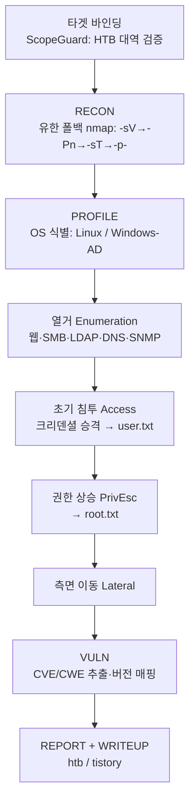
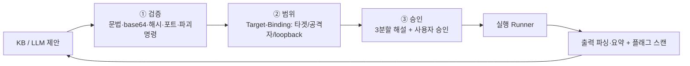

# htb-agent 아키텍처

HTB 머신 승인제 자동 풀이 에이전트의 구조·흐름·안전 모델을 한 곳에 정리한 문서.
(이전의 조각난 ROADMAP 을 대체하는 단일 기준 문서)

---

## 1. 한눈에 보기

- **목적**: 권한이 확인된 HTB 머신을 모의해킹 **표준 단계 순서**로 풀이 보조.
- **원칙**: 승인제(사람이 실행 승인) · 외부 라이트업 미참조(사용자 자료만) ·
  무한루프 금지(유한 상한) · 증거기반 판단(〔확인〕/〔추정〕).
- **실행 환경**: Kali/Ubuntu + HTB VPN (개발·테스트는 어디서나, 표준 라이브러리만).

---

## 2. 진행 파이프라인 (모의해킹 단계 순서)



각 단계는 **해당 phase 의 KB 규칙 + LLM(단계 힌트) 적응 라운드**를 돌리고,
이전 관측을 다음 제안에 반영한다. 전역 상한(`max_enum`·`max_llm`) + 라운드
상한(`max_rounds`) + "새 명령 없으면 조기 종료"로 **반드시 유한**하다.

**반복·재진입 스윕(A1)**: 전 단계 1회 통과를 1스윕으로 보고, 한 스윕 뒤 **월드
모델 상태가 성장**하면(새 관측·크리덴셜·서비스·권한레벨로 이전 단계가 다시 유효해지면)
다음 스윕을 돈다(`max_sweeps`, 기본 2). 실제 모의해킹의 비선형성(예: 권한상승에서 얻은
단서가 열거를 다시 열어줌)을 반영한다. 명령 중복제거(`seen_cmds`)·전역 예산·**상태 정체
시 조기 종료**(`_world_fingerprint` 가 그대로면 중단)로 여전히 **유한**하다.

**단계 게이팅(A2)**: 각 단계의 전제조건을 월드 모델의 권한레벨·크리덴셜로 판정한다
(`_prereq_met`). enum/access 는 항상 가능, privesc 는 user 쉘/크리덴셜, lateral 은
크리덴셜/해시 등 이동수단이 있어야 **투기적 LLM 라운드**를 돈다. 전제 미충족 단계는
KB 가이드(수동 제안)는 남기되 LLM 라운드를 건너뛰고 `대기(사유)`로 표시하며,
A1 스윕에서 상태가 자라면(크리덴셜 확보 등) 다음 스윕에 자동 활성화된다.

**병렬 열거(옵션)**: `max_parallel>1` 이면 한 라운드의 명령들을 게이트(검증·범위·승인)는
**순차로** 통과시킨 뒤 `runner.run`(서브프로세스 I/O)만 스레드풀로 **동시 실행**하고,
결과 처리(파싱·플래그/해시/크리덴셜 스캔·월드 갱신)는 다시 **제출 순서대로 단일
스레드**에서 수행한다. 공유 상태 경쟁이 없고 결과·순서가 순차 실행과 **동일**하다
(기본 `max_parallel=1`=순차). 승인 게이트는 그대로 — 병렬은 I/O 가속일 뿐이다.

실행 가능한 각 명령은 `variants.py` 가 도구별로 **유효·안전한 옵션 조합 변형
(경우의 수)** 을 `max_variants` 개까지 생성해 순서대로 시도한다(기본 명령이 항상
첫 번째, 이미 있는 플래그는 중복 추가 안 함). 변형도 `max_enum`·중복제거 예산에
포함되어 유한하며, 각 변형이 아래 3관문을 그대로 통과한다.

---

## 3. 실행 전 3관문 (모든 명령 공통)



LLM 이 제안한 명령도 '신뢰하지 않는 데이터'로 간주되어 이 3관문을 반드시 통과한다.

---

## 4. 모듈 지도

| 영역 | 모듈 | 역할 |
|---|---|---|
| **안전** | `scope_guard.py` | Target-Binding, 범위밖 기본거부 |
| | `command_validator.py` | 문법·base64·16/10진수·포트·해시·파괴명령 |
| | `approval.py` | 승인 게이트 + 바이너리/옵션/파라미터 3분할 해설 |
| **관측** | `observation/parsers.py` | nmap(XML/텍스트)·HTTP 파싱 |
| | `observation/web.py` | gobuster·ffuf·feroxbuster·nikto·whatweb |
| | `observation/smb.py` | smbclient·smbmap·netexec |
| | `observation/ad.py` · `net.py` | ldapsearch · dig·snmpwalk |
| | `observation/summarize.py` · `compressor.py` | 도구별 요약 라우팅 · 토큰 절감 |
| **식별** | `target_profiler.py` | Linux vs Windows-AD, 증거기반 확신도 |
| **지능** | `knowledge.py` + `knowledge/` | 단계별 규칙·노트·취약점(사용자 학습으로 성장) · **관련도 기반 노트 랭킹**(relevant_notes, 경량 RAG — 서비스/OS/단계/CVE 키워드 겹침) |
| | `world.py` | 월드 모델 — 구조화 상태(hosts/services/creds/loot/flags/vulns/access_level) 단일 상태원. 파이프라인·LLM 컨텍스트·리포트의 출처 |
| | `orchestrator.py` | 단계 순서 상태머신(유한) + 월드 모델 갱신 |
| | `variants.py` | 도구별 옵션 조합 변형(경우의 수) 생성 |
| | `variant_stats.py` | 실행 결과 기반 변형 학습(성공률로 변형 순서 재정렬, 세션 넘어 영속) |
| | `llm/` | Claude/Ollama 프로바이더 + 티어링 + 캐싱·비용 · **HybridRouter**(단계 난이도→로컬/강력 라우팅+상호 폴백) · **분석가 역할**(analyze: 상태→가설·공격경로·집중·확신도, 명령 생성 유도) · **구조화 출력**(JSON 배열 command/rationale/expected_signal 우선 파싱, 라인 폴백) · **적응형 tier**(저확신/빈결과 시 강력 모델 승격) |
| | `learn.py` | 권위 출처 자가학습(--learn, 허용도메인·캐시·P1 유지) → 지식베이스 노트. 59주제 종합 레퍼런스 시드로 '동일 완비 지식' 시작 보장 |
| | `knowledge_gaps.py` | **자율 지식 획득**(--learn-gaps): 관측 기술→권위 주제 별칭 해석(토큰 인식)·공백 감지→권위 출처 자동 학습→KB 즉시 반영. 미해석 공백은 웹학습 위임 또는 기록(allowlist·P1 유지) |
| | `web_search.py` | **인터넷 검색 학습**(--web-learn): 미해석 공백을 웹 검색으로 학습→KB 반영. **HTB 라이트업 가드**(공식·제3자 전부 차단, 사용자 ingest 만 예외) · 일반 기법/문서 허용 · **교차검증**(신뢰등급 A/B 또는 독립 출처 상호확인, 보안 관련성 게이트) · 검색 차단 시 Wikipedia API 폴백 · 신뢰불가 데이터(노트 저장만) |
| | `diagnostics.py` | **실패 진단**(사람 보고용): 404/403/401/429·연결거부·타임아웃·DNS·도구부재를 분류해 '대상 응답' vs '환경/도구/네트워크'로 구분. 환경 실패는 경로 포기 근거 아님(오판 방지). 리포트 BLOCKERS 섹션. 자동 재공격 아님 |
| | `provenance.py` | **플래그 출처 검증**(ctf-abacus류): 플래그를 만든 명령을 실행 트레이스로 분류 — 공략 유래 vs 로컬/지식/불명. 암기·검색·추측과 실제 공략을 구분해 사람에게 보고(점수 변경 없음) |
| | `repetition.py` | **반복·정체 감지**(AutoPentester류 Repetition Identifier): 실행 트레이스에서 같은 서명 명령·같은 실패 범주 반복·정체를 감지해 리포트 REPETITION 섹션으로 사람에게 보고. 다음 명령 자동 변경 없음(효율·깊이우선함정 완화) |
| **실행** | `tools/runner.py` | Subprocess(실제) / Fake(테스트) |
| | `tools/recon.py` | 유한 폴백 포트스캔 |
| | `tools/registry.py` + `scripts/install_tools.sh` | 도구 목록·가용성 + 일괄 설치 |
| **목표** | `vuln.py` + `knowledge/vulns/` | CVE/CWE 탐지·매핑 |
| | `flag.py` | user.txt/root.txt 탐지·분류 |
| | `revshell.py` | 리버스쉘 페이로드 생성(--revshell + 풀이 중 공격자 IP 확보 시 자동 준비, 생성 전용·인젝션 검증) |
| | `cloud.py` | AWS/S3 열거 자동 준비(--cloud + 호스트명/도메인 확보 시 버킷후보·비인증점검 생성, 생성 전용·AWS 는 범위 밖) |
| | `privesc.py` | 권한상승 플레이북 자동 준비(--privesc + OS 식별 시 열거·점검·LPE후보 생성, 생성 전용·대상 셸 실행) |
| | `crack.py` | 해시 크래킹 자동 준비(--crack + 출력/볼트에서 해시 수집·식별→john/hashcat 명령 생성, 생성 전용) |
| **운영** | `state.py` | 세션 상태 영속(중단/재개) |
| | `creds.py` | 크리덴셜 볼트(수동제안 → 실행 승격) |
| | `creds_harvest.py` | 실행 출력에서 평문 자격 자동 수확(고신뢰 패턴·셸-안전 값만 볼트 투입, 월드 반영→A1 재진입 활성화) |
| | `audit.py` | 실행 트랜스크립트(JSONL) |
| | `config.py` | 설정 파일(JSON/YAML, CLI>config>기본) |
| | `environment.py` · `main.py` · `__main__.py` | Kali 프리플라이트 · CLI 진입점(ASSASSIN) · `python -m` 진입 |
| | `util.py` | 공용 헬퍼(바이너리 추출 등) |
| | `doctor.py` | 환경 자가진단(--doctor: 도구·LLM·VPN, 초보자용) |
| | `ui.py` | 터미널 렌더링(블루/네이비 색상·박스·정렬, NO_COLOR/비-TTY 자동 무색) |
| | `profiles.py` | 플랫폼 프로파일(HTB/Dreamhack/CTF: 스코프·플래그·카테고리) |
| | `enrich.py` | CVE/CWE 자동 수집(NVD·GitHub PoC, 주입식 fetcher·캐시·오프라인 안전) |
| | `approval.py` | 승인 게이트(스마트=범위밖만 확인 / auto / manual) + 3분할 해설 |
| | `writeup.py` | 라이트업 생성(htb-ctf-writeup-v5 / Tistory 13섹션) |
| | `report_export.py` | 결과 내보내기 — 기계판독 JSON · 블루/네이비 HTML 대시보드 |

---

## 5. 데이터·성장·운영 저장소

- **학습데이터(성장)**: `knowledge/rules/*.json`(단계별 액션) · `notes/*.md`(노하우) ·
  `vulns/*.json`(버전→CVE). 파일을 추가할수록 제안이 풍부해진다. 외부 검색 없음.
- **세션 상태**: `state/<타겟>.json` — 포트·OS·발견·크리덴셜·플래그·이력 (중단/재개).
- **감사 로그**: `state/audit_<타겟>.jsonl` — 모든 제안·검증·승인·실행·플래그.
- (모두 `.gitignore` 처리 — 로컬·민감정보)

---

## 6. 사용법 요약

```bash
cd htb-agent
sudo ./scripts/install_tools.sh                 # Kali 보안 도구 일괄 설치
pip install -e .                                # 에이전트 설치 → 'htb-agent' 명령
assassin 10.129.1.5                            # 승인제 풀이
assassin 10.129.1.5 --auto \
  --cred administrator:Passw0rd \               # 자격증명 → access/flag 승격
  --llm claude --writeup                        # LLM 두뇌 + 라이트업 생성
assassin 10.129.1.5 --resume                   # 중단 지점 재개
```

전체 옵션은 `assassin --help`. 설치 없이 쓰려면 `PYTHONPATH=src python3 -m htb_agent ...`.

---

## 7. 테스트

```bash
cd htb-agent && python3 tests/run_all.py        # 46 스위트 1078 테스트
```

네트워크·도구 없이도 **러너 주입**으로 전 로직 검증하며, 통합 테스트는 `main()` 을
엔드투엔드 구동한다. CI(GitHub Actions)가 push/PR 마다 테스트+컴파일(게이트)과
ruff/mypy(비차단)를 수행한다.

---

## 8. 한계 (과장 금지)

- 명령 검증은 **형식적 무오류 + 실행 가능 형태**까지 보장. 도구별 옵션 의미,
  해시의 정답 여부(평문 없이 불가)는 미보장.
- OS/취약점 판정은 **증거기반 확신도** — 약하면 `〔추정〕` 표기.
- LLM 비용은 **추정치**(pricing). 정확한 청구는 콘솔 확인.
- 실제 공격 실행·VPN 은 사용자 Kali 환경 전용.
